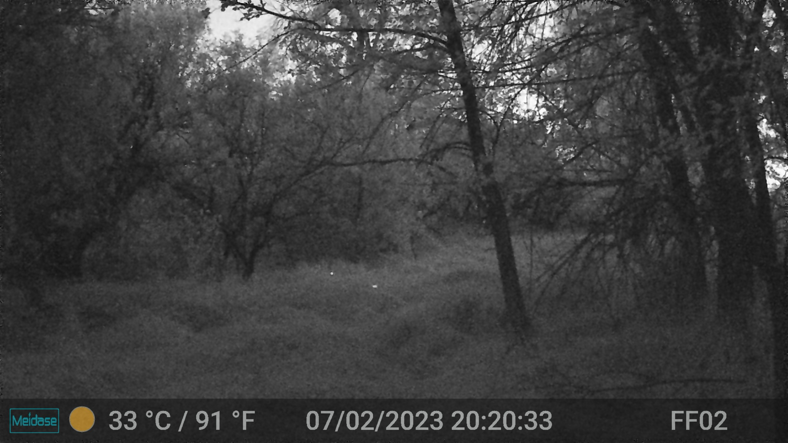

# tiny ghosts :ghost:
The American West is known for its deserts and canyons, but is also rich in biodiversity. 
Its inhabitants include fireflies. :bug::sparkles:

Western firefly populations are small and sparse.
Little is known about them. 
They often reside in remote areas (springs, arroyos, etc.) where access is limited, making their study and monitoring cumbersome.

In 2023, Cheryl Mollohan and Ron Day pioneered the use of low-light trail cameras to monitor firefly populations in Arizona over several weeks. 
Trail cameras capture flashes surprisingly well but produce thousands of pictures which then need to be classified (flash/no flash). 

## Purpose
`tiny-ghosts` is a project for automated detection of firefly flashes in trail cameras images using computer vision.
In this context, finding which pictures show firefly flashes is not an easy task.
The pictures have low contrast, show a complex background, with uneven and changing illumination (moon, lightning), and various kinds of hotspots and artifacts (headlights).

## Pipeline

### organize and classify pictures
- `pre/organize_pictures.py`: appends date+time to picture filename and organizes by date folders
- `pre/calculate_image_stats.py`: calculate max, average, and std or pixel brightness of all pictures in root folder
- `pre/organize_pictures_from_imstats.py`: sorts pictures into 4 categories: null, days, dusk, dark

`null/` is for pictures with max pixel intensity below a threshold (usually 50); these pictures don't have any bright spot and hence no firefly. It can be up to 50% of the set. 
`days/` is for pictures in color; they are bright and flashes are hard to see, even by eye
`dusk/` grayscale pictures with significant texture; where VLMs are most useful and efficient
`dark/` almost completly dark pictures, inetnsity thersholding could also locate flashes

### Vision Language Models for flash identification
The past couple years have seen the emergence of vision language models, or VLMs.
They have a global, rather than local, understanding of images and excel at complex vision tasks, such as identifying firefly flashes.
They work great on the `dusk` and `dark` folders.
Different VLMs:

#### GPT
The most successful approach has been using the OpenAI API to pass images to their vision models and return a yes or no for the presence of flashes.
I have found that the model becomes increasingly accurate when images are split into patches (512x512 to match the API constraints), although the processing is slower.
A downside of this approach is the non-negligible cost, but depends on the model.

I'm investigating using the logits/softmax value to adapt the threshold of positive/negative, possibly away from p = 0.5.

`tg_vis_folder.py` calls the API. 
The best models are `4.1` and `4.1-mini` (cheaper). `4o` is also good. `4.1-nano` not so much.

#### Llava
[Llava](https://llava-vl.github.io) is a vision model based on Llama. 
It performs reasonably well to identify patches, although not as well as GPT. 
It is free and runs on a MacBook Pro M2.

#### Deepseek
I am testing the newer VLMs from Deepseek, especially Janus and VL2.
Janus, called by API from a Hugging Face Space, is very good on `dusk` pictures. 
See `dsk/` folder

### Post processing
Once images have been processed, it is advised to use the `post/verif-eye.py` GUI to manually check if positive pictures are true positives.
Aftwerwards, running `xlsx_export.py` will extract metadata from all psoitive pictures and put the data in a spreasheet.

### Blob detection + CNN classification
Based on [`firefleye-net`](https://github.com/rapsar/firefl-eye-net). 
Coming soon.

## To-Do
- set up a benchmark for VLM performance of firefly detection tasks
- resolve the problem of stars/planes, which look very much alike flashes

